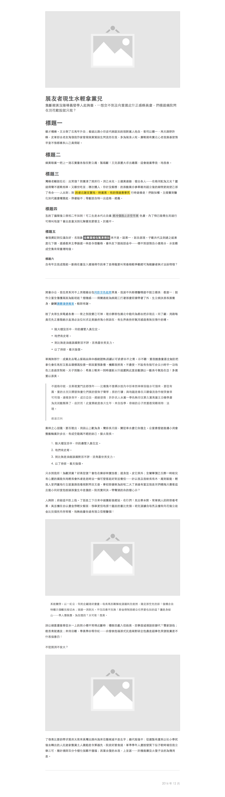

# Drafton
爪芙特是一個簡單的 HTML5 基本頁面骨架，用作為一般文章、草稿。

## 支援標籤

目前僅打算支援基本的純文字與少部份的多媒體標籤。

**標頭**
`<h1></h1>`、`<h2>`、`<h3>`、`<h4>`、`<h5>`、`<h6>`

**語氣**
`<i>`、`<strong>`、`<del>`

**多媒體**
`<figure>`、`<figcaption>`、``

**文書**
`<hr>`、`<blockquote>`、`<cite>`、`<ul>`、`<ol>`、`<li>`、`<p>`、`<a>`、`<time>`

**標記**
`<kbd>`、`<label>`、`<mark>`

## 基本結構

已經有包含一個完整的範例於 `index.html`，可以直接修改該檔案進行實作。

```html
<main>

    <!-- 頁頭 -->
    <header>
        <!-- 封面 -->
        
        <!-- / 封面 -->

        <!-- 標題 -->
        <strong></strong>
        <!-- / 標題 -->

        <!-- 子標題 -->
        <small></small>
        <!-- / 子標題 -->
    </header>
    <!-- / 頁頭 -->

    <!-- 頁面主要內容 -->
    <section>
    </scetion>
    <!-- / 頁面主要內容 -->

    <!-- 頁腳 -->
    <footer>
    </footer>
    <!-- / 頁腳 -->
</main>
```

## 頁面預覽

你可以前往 [drafton.teameow.com/](https://drafton.teameow.com/) 直接預覽，這裡是預覽結果。

